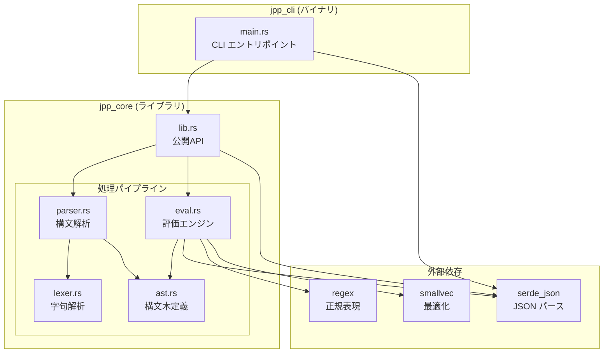
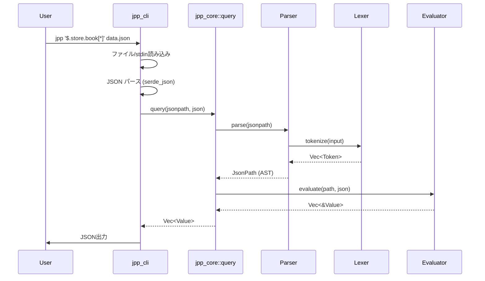
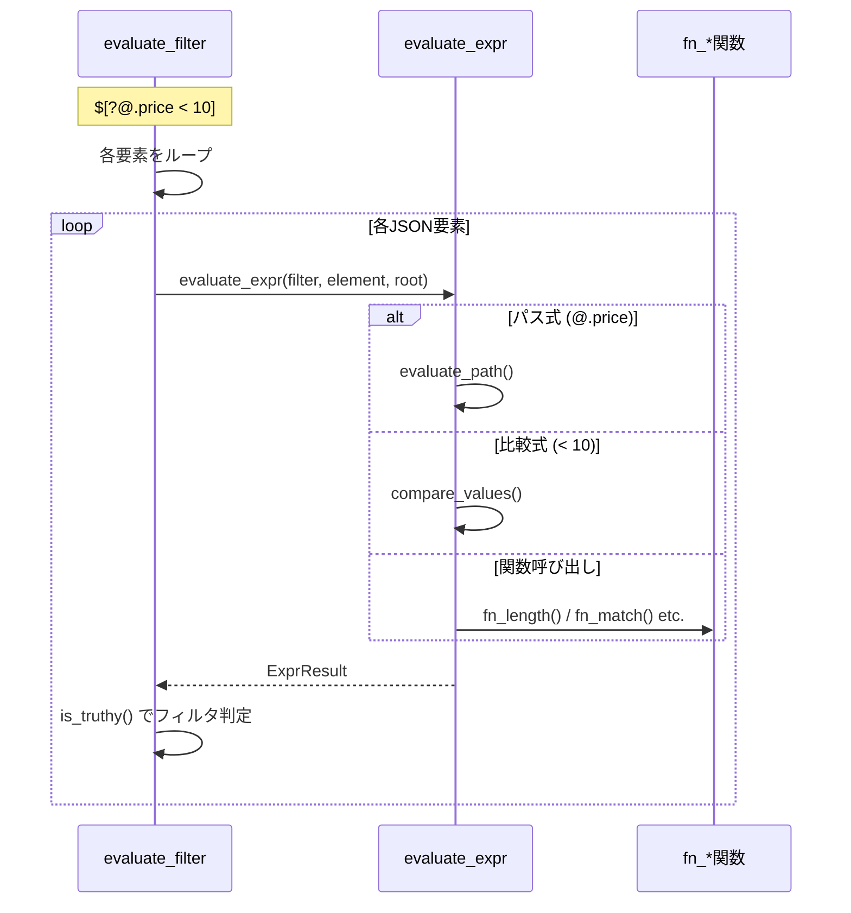
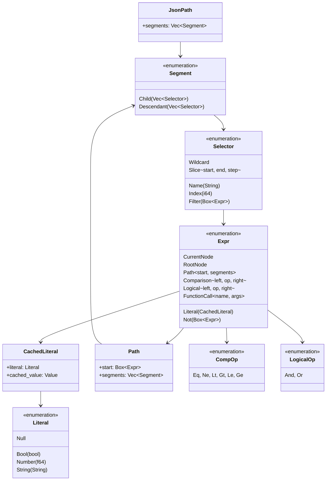
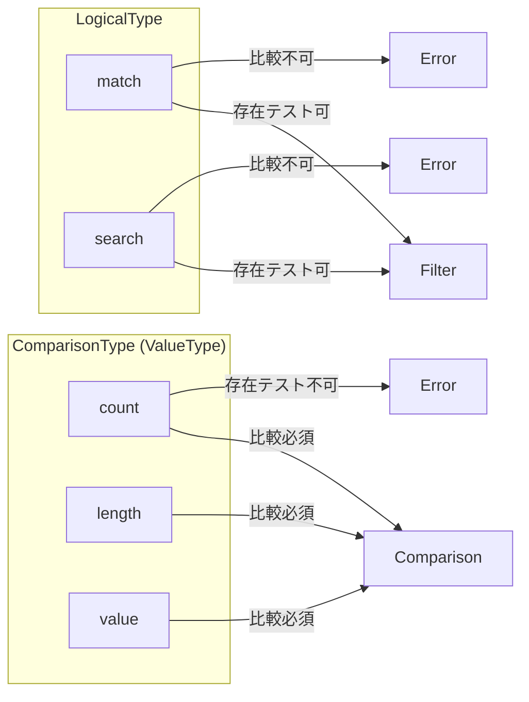
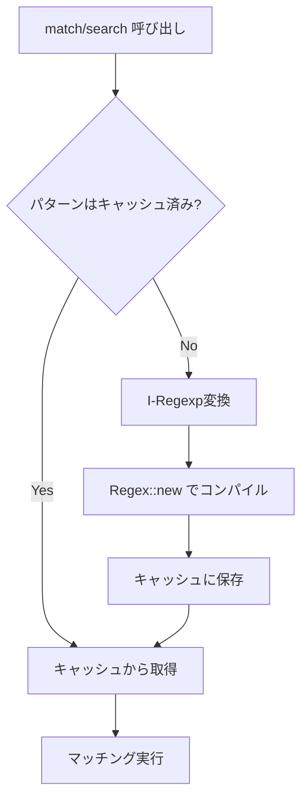
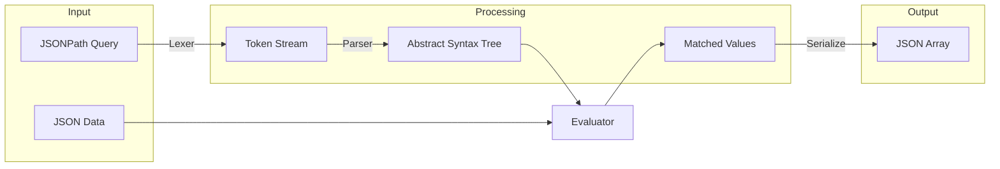
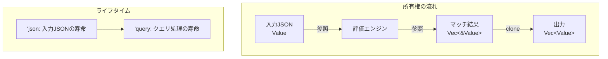
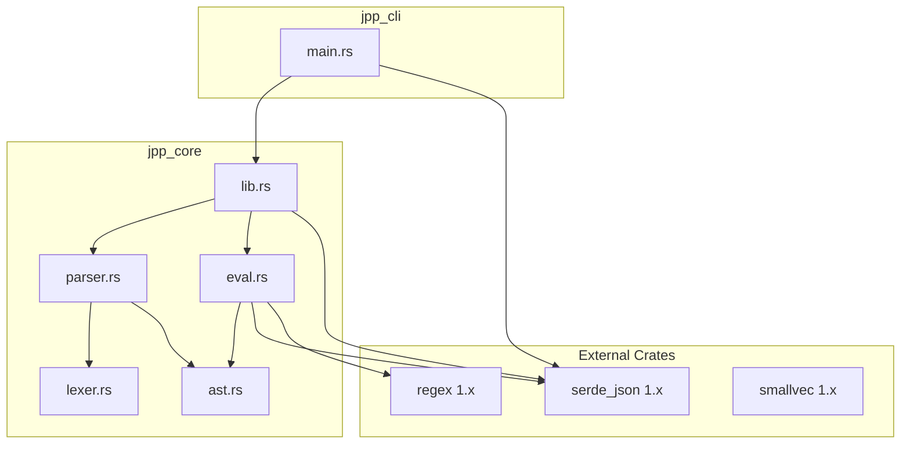
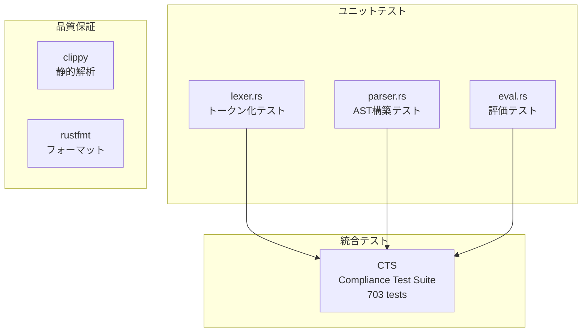

# jpp アーキテクチャドキュメント

## 概要

**jpp** (JSONPath Processor) は RFC 9535 準拠の JSONPath クエリエンジンです。
Rust で実装され、CLI ツールとライブラリの両方として利用可能です。

### 設計原則

1. **RFC 9535 厳密準拠**: 仕様からの逸脱を許さない
2. **最小依存**: 外部クレートを最小限に抑える
3. **段階的処理**: Lexer → Parser → Evaluator の明確な分離
4. **テスト駆動**: CTS (Compliance Test Suite) による品質保証

---

## システム構成



---

## クレート構成

```
jpp/
├── Cargo.toml              # ワークスペース定義
├── crates/
│   ├── jpp_core/           # コアライブラリ
│   │   ├── src/
│   │   │   ├── lib.rs      # 公開API (query関数)
│   │   │   ├── ast.rs      # AST型定義
│   │   │   ├── lexer.rs    # トークナイザ
│   │   │   ├── parser.rs   # パーサ
│   │   │   └── eval.rs     # 評価エンジン
│   │   └── tests/
│   │       └── cts_test.rs # CTS統合テスト
│   ├── jpp_cli/            # CLIバイナリ
│   │   └── src/
│   │       └── main.rs
│   └── jpp_bench/          # ベンチマーク
│       ├── benches/
│       │   └── jsonpath.rs
│       └── data/           # ベンチマーク用JSONデータ
└── tests/
    └── cts/                # CTS (git submodule)
```

---

## 処理フロー

### クエリ実行フロー



### フィルタ評価フロー



---

## モジュール詳細

### 1. ast.rs - 構文木定義

RFC 9535 の文法構造を Rust の型として表現します。



**`Expr::Path` の構造:**

```rust
Path {
    start: Box<Expr>,      // CurrentNode (@) または RootNode ($)
    segments: Vec<Segment>, // パスセグメントのリスト
}
```

例: `@.store.book[0]` は以下のように表現されます:
- `start`: `CurrentNode`
- `segments`: `[Child([Name("store")]), Child([Name("book")]), Child([Index(0)])]`

**設計判断:**
- `Box<Expr>` で再帰構造を表現（フィルタ内のネストに対応）
- `Segment` は `Child` と `Descendant` の2種類のみ（RFC 9535準拠）
- 数値は `f64` で統一（JSON の Number 型に合わせる）
- `CachedLiteral` でパース時に `serde_json::Value` をキャッシュ（評価時の変換コスト削減）

### 2. lexer.rs - 字句解析

入力文字列をトークン列に変換します。

**主要な型:**

| 型 | 説明 |
|---|---|
| `TokenKind` | トークン種別（Root, Dot, BracketOpen, ...） |
| `Token` | トークン + 位置情報 |
| `Lexer` | トークナイザ本体 |

**`Number` トークンの構造:**

```rust
Number(f64, bool)  // (値, has_decimal_or_exp)
```

第2引数 `has_decimal_or_exp` は数値が小数点または指数表記を含むかを示します。
これはインデックスセレクタで整数のみを許可するために使用されます。

```rust
// parser.rs での使用例
if has_decimal_or_exp {
    return Err("index must be an integer, not a decimal");
}
```

**処理内容:**
1. 1文字/2文字演算子の識別（`<` vs `<=`、`.` vs `..`）
2. 文字列リテラルの解析（エスケープシーケンス対応）
3. 数値リテラルの解析（整数/小数/指数表記）
4. Unicode識別子の対応

**RFC 9535 準拠ポイント:**
- 制御文字 (U+0000-U+001F) の検出とエラー
- サロゲートペアの正しい処理
- 先頭ゼロの数値を拒否（例: `01`, `007`）
- `-0` はスライスでは有効（0と等価）、インデックスでは拒否

**エラー型:**

```rust
pub struct LexerError {
    pub message: String,
    pub position: usize,  // エラー位置（エラーメッセージの品質向上用）
}
```

### 3. parser.rs - 構文解析

トークン列を AST に変換します。再帰下降パーサで実装。

**文法の優先順位:**

```
Expression  → OrExpr
OrExpr      → AndExpr ('||' AndExpr)*
AndExpr     → CompExpr ('&&' CompExpr)*
CompExpr    → UnaryExpr (CompOp UnaryExpr)?
UnaryExpr   → '!' UnaryExpr | Atom
Atom        → '@' Path? | '$' Path? | Literal | FunctionCall | '(' Expression ')'
```

**RFC 9535 検証:**

| 検証内容 | 実装箇所 |
|---------|---------|
| 先頭/末尾の空白禁止 | `parse()` |
| 整数範囲 ±(2^53-1) | `try_parse_index_number()` |
| `-0` の拒否（インデックス） | `try_parse_index_number()` |
| LogicalType の比較禁止 | `parse_comparison_expression()` |
| ComparisonType の存在テスト禁止 | `parse_selector()` |
| 関数引数の型検証 | `validate_function_params()` |
| 未知関数の拒否 | `validate_function_params()` |

**キーワードプロパティ (RFC 9535):**

RFC 9535 では `true`, `false`, `null` はプロパティ名として有効です:

```javascript
$.true   // プロパティ "true" にアクセス
$.false  // プロパティ "false" にアクセス
$.null   // プロパティ "null" にアクセス
```

実装では `keyword_to_property_name()` 関数がこれを処理します:

```rust
fn keyword_to_property_name(kind: &TokenKind) -> Option<&'static str> {
    match kind {
        TokenKind::True => Some("true"),
        TokenKind::False => Some("false"),
        TokenKind::Null => Some("null"),
        _ => None,
    }
}
```

**関数型システム (RFC 9535):**



**エラー型:**

```rust
pub struct ParseError {
    pub message: String,
    pub position: usize,  // エラー位置（エラーメッセージの品質向上用）
}

// LexerError から自動変換
impl From<LexerError> for ParseError { ... }
```

### 4. eval.rs - 評価エンジン

AST を JSON データに対して評価し、マッチする値を返します。

**主要な関数:**

| 関数 | 説明 |
|------|------|
| `evaluate()` | エントリポイント |
| `evaluate_segment()` | Child/Descendant セグメントの評価 |
| `evaluate_selector()` | 個別セレクタの評価 |
| `evaluate_filter()` | フィルタ式の評価 |
| `evaluate_expr()` | 式の評価 |
| `compare_values()` | RFC 9535 準拠の値比較 |

**式評価の結果型 `ExprResult`:**

```rust
enum ExprResult {
    Value(Value),         // 単一値（リテラル、関数結果）
    NodeList(Vec<Value>), // 複数ノード（パス式の結果）
    Nothing,              // 結果なし（存在しないプロパティなど）
}
```

**`NodeList` と `Value` の使い分け（RFC 9535 存在テスト）:**

RFC 9535 では「存在テスト」の定義が重要です:

```javascript
$[?@.a]  // @.a が存在すれば true（null でも存在とみなす）
```

この仕様を正しく実装するため:

| 式 | 結果型 | is_truthy() |
|---|---|---|
| `@` (現在ノード) | `NodeList([node])` | `true` |
| `@.existing` | `NodeList([value])` | `true` |
| `@.existing` (値がnull) | `NodeList([null])` | `true` (存在する) |
| `@.missing` | `NodeList([])` | `false` (存在しない) |
| `true` (リテラル) | `Value(true)` | `true` |
| `null` (リテラル) | `Value(null)` | `false` |

**重要な設計判断:**
- パス式は常に `NodeList` を返す（空でも）
- `{"a": null}` に対して `$[?@.a]` はマッチする（`a` が存在するため）
- リテラル `null` の `is_truthy()` は `false`

**負のインデックスとスライス処理:**

RFC 9535 では負のインデックスは配列の末尾からの相対位置を示します:

```javascript
$[-1]    // 最後の要素
$[-2]    // 最後から2番目
$[0:-1]  // 最後の要素を除く全て
```

実装では `normalize_index()` が正規化を行います:

```rust
fn normalize_index(index: i64, len: usize) -> Option<usize> {
    if index >= 0 {
        let idx = index as usize;
        if idx < len { Some(idx) } else { None }
    } else {
        // 負のインデックス: len + index
        let positive = len as i64 + index;
        if positive >= 0 { Some(positive as usize) } else { None }
    }
}
```

**スライスの負のステップ:**

```javascript
$[4:1:-1]  // インデックス 4, 3, 2 を逆順で取得
$[::-1]    // 配列全体を逆順
```

`evaluate_slice()` は負のステップを特別に処理します:
- `step > 0`: `start` から `end` へ前進
- `step < 0`: `start` から `end` へ後退（デフォルト値が逆転）

**正規表現キャッシュ:**



**I-Regexp 変換 (RFC 9485):**

```rust
fn transform_pattern_for_iregexp(pattern: &str) -> String {
    // 1. 文字クラス内かどうかを追跡
    // 2. エスケープされた文字はそのまま維持
    // 3. 文字クラス外の . を [^\r\n] に変換
}
```

変換ルール:
- `.` → `[^\r\n]`（`\r` と `\n` を除外）
- 文字クラス内の `.` → そのまま維持（例: `[.]`）
- エスケープされた `\.` → そのまま維持

### 5. lib.rs - 公開API

ライブラリの主要な公開API:

```rust
// パースと実行を分離するAPI（推奨）
impl JsonPath {
    pub fn parse(jsonpath: &str) -> Result<Self, Error>;
    pub fn query<'a>(&self, json: &'a Value) -> Vec<&'a Value>;
}

// 便利関数（一回限りのクエリ用）
pub fn query<'a>(jsonpath: &str, json: &'a Value) -> Result<Vec<&'a Value>, Error>
```

**エラー型の統一:**

```rust
pub struct Error {
    message: String,
}

impl From<ParseError> for Error { ... }  // ParseError から変換
// LexerError は ParseError 経由で変換される
```

**設計判断:**
- 結果は `Vec<&Value>`（参照を返す、ゼロコピー）
- `JsonPath::parse()` でパース済みクエリを再利用可能
- エラーは独自の `Error` 型に統一

### 6. main.rs - CLI

**コマンドライン仕様:**

```
jpp [OPTIONS] <QUERY> [FILE]

Arguments:
  <QUERY>    JSONPath クエリ
  [FILE]     入力ファイル（省略時は stdin）

Options:
  -h, --help     ヘルプ表示
  -V, --version  バージョン表示
```

**終了コード:**
- `0`: 成功
- `1`: エラー（パース失敗、ファイル読み込み失敗など）

---

## データフロー

### 入力から出力まで



### メモリ管理



---

## 依存関係



**依存クレートの選定理由:**

| クレート | 理由 |
|---------|------|
| `serde_json` | デファクトスタンダード、高速、広く使われている |
| `regex` | Rust標準の正規表現、Unicode対応 |
| `smallvec` | ヒープアロケーション削減によるパフォーマンス向上 |

---

## テスト戦略



**CTS (Compliance Test Suite):**
- JSONPath 標準の公式テストスイート
- 703 テストケースで RFC 9535 準拠を検証
- `tests/cts.json` に格納

---

## 拡張ポイント

### 新しい関数の追加

1. `parser.rs`: `COMPARISON_TYPE_FUNCTIONS` または `LOGICAL_TYPE_FUNCTIONS` に追加
2. `parser.rs`: `validate_function_params()` に検証ロジックを追加
3. `eval.rs`: `evaluate_function()` に実装を追加
4. テストを追加

### パフォーマンス最適化（Phase 4）

| 改善項目 | 影響箇所 | 期待効果 |
|---------|---------|---------|
| パターン変換キャッシュ | eval.rs | match/search の高速化 |
| 参照ベース設計 | parser.rs | メモリ削減 |
| SIMD JSON パース | lib.rs | 大規模 JSON の高速化 |

---

## セキュリティ考慮事項

1. **入力検証**: Lexer/Parser で不正入力を早期拒否
2. **再帰制限**: 深いネストによるスタックオーバーフロー防止（将来検討）
3. **正規表現 DoS**: 悪意あるパターンへの対策（regex クレートに依存）

---

## 参考資料

- [RFC 9535 - JSONPath](https://www.rfc-editor.org/rfc/rfc9535.html)
- [RFC 9485 - I-Regexp](https://www.rfc-editor.org/rfc/rfc9485.html)
- [JSONPath Compliance Test Suite](https://github.com/jsonpath-standard/jsonpath-compliance-test-suite)
