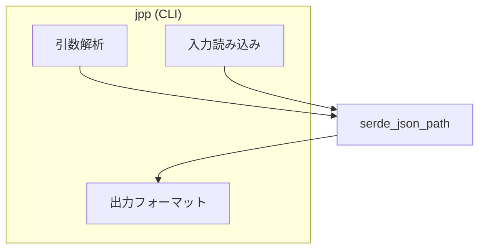
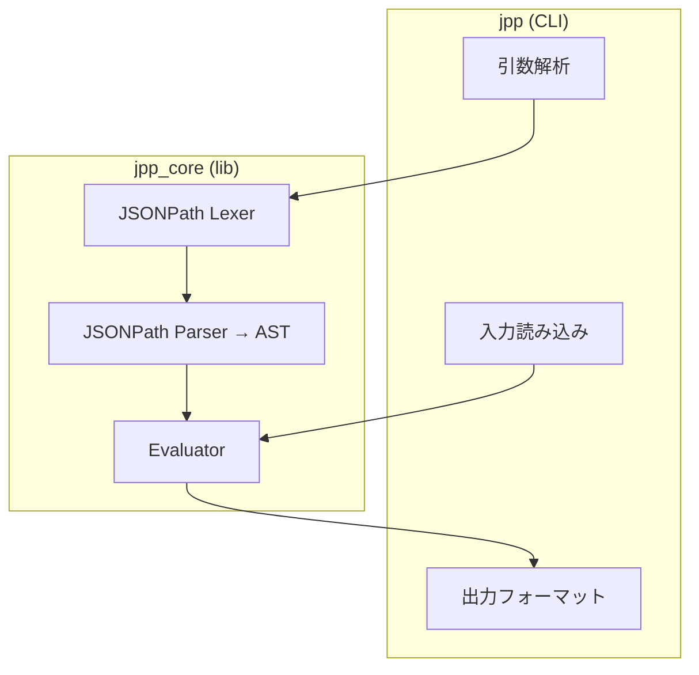

# jpp 開発計画書

## 1. プロジェクト概要

**jpp**（JSONPath Processor）は、RFC 9535準拠のJSONPathクエリを実行するCLIツールです。

### ビジョン
- **標準準拠**: RFC 9535に完全準拠し、実装間の互換性問題を解消
- **高速**: Rustの特性を活かした高速なクエリ処理
- **軽量**: 最小限の依存関係とバイナリサイズ

### なぜ作るのか
| 既存ツール | 課題 |
|-----------|------|
| jq | 独自DSLの学習コストが高い |
| 各種JSONPathライブラリ | 方言が多く、互換性がない |
| 既存JSONPath CLI | パフォーマンスが不十分な場合がある |

---

## 2. 目標と非目標

### 目標（In Scope）
- RFC 9535 JSONPathの完全実装
- stdin / ファイルからのJSON入力
- 複数の出力形式（JSON, テキスト）
- 高速なクエリ処理
- クロスプラットフォーム対応（Linux, macOS, Windows）

### 非目標（Out of Scope）
- JSONの変換・編集機能（jqのような変換DSL）
- ストリーミングJSON処理（NDJSON入力）
- JSONPath以外のクエリ言語サポート
- GUIやWeb UI

---

## 3. 技術スタック

### 言語・ツールチェイン
- **Rust** (Edition 2024 / MSRV: 1.85+)
- **Cargo** ワークスペース構成
- **ライセンス**: MIT

### 依存クレート（案）
| 用途 | クレート | 備考 |
|------|---------|------|
| CLI引数解析 | 自前実装 | オプションが少ないため依存不要 |
| JSONパース | `serde_json` or `simd-json` | Phase 1ではserde_json |
| エラー表示 | 自前実装 | シンプルなエラーメッセージで十分 |
| Phase 1 JSONPath | `serde_json_path` | RFC 9535準拠、Compliance Test Suite（CTS）検証済み |

---

## 4. アーキテクチャ

### Phase 1（プロトタイプ）



### 目標アーキテクチャ（Phase 2以降）



### ワークスペース構成（Phase 2以降）
```
jpp/
├── Cargo.toml          # workspace定義
├── crates/
│   ├── jpp_core/       # コアライブラリ
│   │   ├── src/
│   │   │   ├── lexer.rs
│   │   │   ├── parser.rs
│   │   │   ├── ast.rs
│   │   │   └── eval.rs
│   │   └── Cargo.toml
│   └── jpp_cli/        # CLIバイナリ
│       ├── src/
│       │   └── main.rs
│       └── Cargo.toml
└── tests/              # 統合テスト / CTSテスト
```

---

## 5. CLIインターフェース設計

### 基本使用法
```bash
# パイプ入力
cat data.json | jpp '$.store.book[*].author'

# ファイル指定
jpp '$.store.book[*].author' data.json
```

### オプション
```
jpp [OPTIONS] <QUERY> [FILE]

Arguments:
  <QUERY>    JSONPathクエリ（RFC 9535形式）
  [FILE]     入力ファイル（省略時はstdin）

Options:
  -h, --help              ヘルプ表示
  -V, --version           バージョン表示
```

> **注**: 上記はPhase 1で実装するオプションです。
> `-c`, `-r`, `--color` 等の追加オプションはPhase 5+で検討します。

### 終了コード
| 状況 | コード |
|------|--------|
| 正常終了 | 0 |
| エラー（パース、クエリ構文など） | 1 |

---

## 6. RFC 9535対応範囲

RFC 9535で定義されている機能と自前実装時の優先度：

> **注**: Phase 1では serde_json_path を使用するため、全機能が利用可能です。
> 以下はPhase 2以降で自前実装する際の優先度です。

| 機能 | 例 | 優先度 |
|------|-----|-------|
| Root identifier | `$` | High |
| Child segment (name) | `.store`, `['store']` | High |
| Child segment (index) | `[0]`, `[-1]` | High |
| Wildcard | `[*]`, `.*` | High |
| Descendant | `..` | Medium |
| Array slice | `[0:5]`, `[::2]` | Medium |
| Filter expression | `[?@.price<10]` | Medium |
| 比較演算子 | `==`, `!=`, `<`, `>`, `<=`, `>=` | Medium |
| 論理演算子 | `&&`, `\|\|`, `!` | Medium |
| 関数: length() | `length(@.items)` | Low |
| 関数: count() | `count(@.*)` | Low |
| 関数: match() | `match(@.name, "^A")` | Low |
| 関数: search() | `search(@.name, "foo")` | Low |
| 関数: value() | `value(@.x)` | Low |

---

## 7. 実装フェーズ

### Phase 1: プロトタイプ（MVP）
**目標**: 動くCLIを最速で作り、ユーザビリティを検証

- [ ] CLIスケルトン作成（引数解析は自前実装）
- [ ] 最小限のオプション実装（`-h`, `-V` のみ）
- [ ] stdin / file入力対応
- [ ] 既存JSONPathライブラリ（serde_json_path）で評価
- [ ] JSON出力
- [ ] 基本的なエラーハンドリング

**成果物**: `cat data.json | jpp '$.foo.bar'` が動く

### Phase 2: コア実装開始
**目標**: 独自JSONPathエンジンへの差し替え

**理由**:
- 依存を最小化し、将来的な最適化の余地を確保
- パフォーマンス最適化の自由度を確保
- 将来的な `no_std` 対応やFFIバインディングに備える

- [ ] Lexer実装
- [ ] Parser実装（基本セレクタ）
- [ ] AST定義
- [ ] 基本Evaluator
- [ ] serde_json_pathとの差し替え

### Phase 3: RFC 9535完全対応
**目標**: CTS（Compliance Test Suite）全パス

- [ ] descendant selector対応
- [ ] filter expression対応
- [ ] 組み込み関数対応
- [ ] JSONPath CTS導入・全テストパス

### Phase 4: 最適化
**目標**: 可能な限り高速化（具体的な数値目標は設けず、継続的に改善）

- [ ] ベンチマーク環境構築（競合ツールとの比較）
- [ ] SIMDパース検討（simd-json への置き換え）
- [ ] `no_std + alloc` 対応の検討（jpp_core）
- [ ] クエリコンパイル最適化
- [ ] バイナリサイズ削減
- [ ] メモリ使用量最適化

---

## 8. テスト戦略

### ユニットテスト
- Lexer: トークン化の正確性
- Parser: AST構築の正確性
- Evaluator: 各セレクタの動作

### 統合テスト
- CLI E2Eテスト（終了コード、出力形式）
- エラーケースのテスト

### 準拠テスト
- [JSONPath Compliance Test Suite](https://github.com/jsonpath-standard/jsonpath-compliance-test-suite) の活用
- RFC 9535の全機能カバレッジ

### パフォーマンステスト
- 大規模JSON（10MB+）でのベンチマーク
- 競合ツールとの比較

---

## 9. 将来の展望（Phase 5+）

- [ ] CLIオプション拡張
  - `-c, --compact`: コンパクトJSON出力
  - `-r, --raw-output`: 文字列をクォートなしで出力
  - `--color`: カラー出力
  - `-e, --exit-status`: マッチなしで終了コード1
  - `-f, --from-file`: クエリをファイルから読む機能
  - 複数クエリ対応: `jpp '$.name' '$.age' data.json`
- [ ] FFIバインディング（C/Python/Node.js）
- [ ] WASM対応
- [ ] Language Server Protocol対応（エディタ補完）
- [ ] JSONPath拡張機能の検討

---

## 参考資料

- [RFC 9535 - JSONPath](https://www.rfc-editor.org/rfc/rfc9535.html)
- [JSONPath Compliance Test Suite](https://github.com/jsonpath-standard/jsonpath-compliance-test-suite)
- [serde_json_path](https://github.com/hiltontj/serde_json_path)
